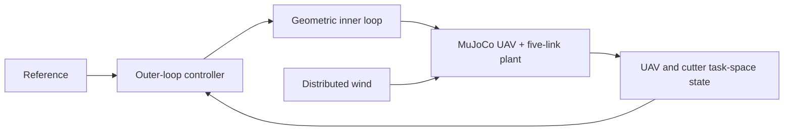

# UAV Multi-Link Anti-Sway Control

[](https://github.com/canimiliya/uav_multilink_antisway_control/actions/workflows/ci.yml)
[](https://www.python.org/)
[](https://mujoco.org/)

Reproducible MuJoCo simulation code for anti-sway control of a 6-DoF UAV carrying five passive rigid links and a 2.5 kg cutter payload under distributed wind disturbances.

## Overview

The project evaluates three frozen outer-loop controllers with the same plant, task-space output, rates, disturbance definition, and actuator limits:

| Method | Implementation | Identity |
|---|---|---|
| PID | Cascaded task PID | `V3CascadedTaskPID` / `hybrid_x007_y041_z041` |
| Full-State LQR | Full-state linear feedback | `V3FullStateLQR` / `full_lqr_048` |
| SATC-OFMPC | Causal constrained task coordination | `SATC-OFMPC` / `satc_b_027` |

The model uses a 1 kHz MuJoCo physics step, a 200 Hz geometric inner loop, and a 20 Hz outer loop. Outer-loop acceleration is limited to 2.0 m/s² and its per-update slew is limited to 0.25 m/s².

## System



## Results

The committed freeze records report 75/75 safety-valid samples for PID and Full-State LQR, with 40/75 and 54/75 task successes respectively. The PID 3-D position RMSE is 0.232386 m and Full-State LQR's is 0.088202 m. SATC-OFMPC's retained overall record reports 120/120 safety, 112/120 task success, 0.097127 m mean position error, and 0.139230 m position p90. See [docs/RESULTS.md](docs/RESULTS.md) for scenario status and the T3 boundary distinction.

## Installation

```bash
git clone --recurse-submodules https://github.com/canimiliya/uav_multilink_antisway_control.git
cd uav_multilink_antisway_control
python -m pip install -r requirements-lock.txt
python -m pip install -e .
```

The lock file installs the pinned Udaan submodule as an editable local dependency. If submodules were not cloned, run `git submodule update --init --recursive` first.

## Quick start

Run a short non-authoritative simulation through the existing runtime:

```bash
python examples/run_demo.py --controller pid
python examples/run_demo.py --controller lqr
python examples/run_demo.py --controller satc
```

The demo writes generated files below `outputs/`, which is ignored by Git. To run the same short task for all three controllers:

```bash
python examples/compare_controllers.py
```

## Reproducing the benchmark records

```bash
python scripts/verify_reproducibility.py
pytest -q
```

The verification script checks the frozen model SHA256, Udaan commit, controller evidence, software version, and T3 archive metadata. It does not retune controllers or rerun T3. The formal benchmark definitions and evidence are under [`reproducibility/`](reproducibility/); the T3 record is explicitly archived.

## Repository structure

```text
configs/                 Frozen model, vehicle, payload, wind, and controller configs
examples/                Short runnable demos
reproducibility/         Model, controller, benchmark evidence, and manifest
scripts/                 Public verification utilities
docs/                    Architecture, methods, results, limits, and notes
src/uav_sway/            Simulation, controller, task-space, and visualization code
tests/                   Smoke and reproducibility tests
third_party/udaan/       Pinned Udaan submodule
```

The scientific implementation modules retain their established source namespaces under `uav_sway.v3`, `uav_sway.v4`, and `uav_sway.v5`; the public documentation uses method names and controller identities instead of development labels.

## Reproducibility and limitations

The source freeze, model hash, controller identities, dependency versions, and runtime limits are recorded in [`reproducibility/manifest.json`](reproducibility/manifest.json). This is simulation-only work with a distributed aerodynamic approximation, passive planar hinges, no hardware validation, and no claim of PX4/ROS 2, online replanning, learning, or real-flight performance. See [docs/REPRODUCIBILITY.md](docs/REPRODUCIBILITY.md) and [docs/LIMITATIONS.md](docs/LIMITATIONS.md).

## Citation

If you use this software, cite the metadata in [`CITATION.cff`](CITATION.cff). The public package version is `1.0.0`.

## License and third-party software

The project is released under the MIT License. Udaan is included as a pinned submodule under its BSD 3-Clause License; see [THIRD_PARTY_NOTICES.md](THIRD_PARTY_NOTICES.md).
