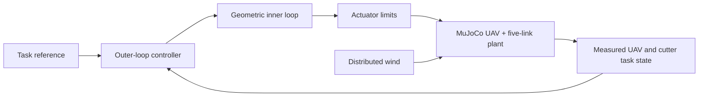

# Architecture

The project simulates a 6-DoF UAV carrying five passive rigid links and a 2.5 kg cutter payload in MuJoCo. Distributed wind disturbances act on the aerial system, links, and payload through the frozen aerodynamic approximation.

The public runtime is organized into model/configuration, disturbances, task-space state and reference handling, controller implementations, native physical-wrench adapters, simulation runners, and visualization. The controller interface receives current causal measurements and the current reference; wind truth is not exposed to the controller.

The frozen control schedule is a 1 kHz physics step, a 200 Hz inner loop, and a 20 Hz outer loop. The outer-loop acceleration authority is limited to 2.0 m/s² with a 0.25 m/s² per-update slew limit.
